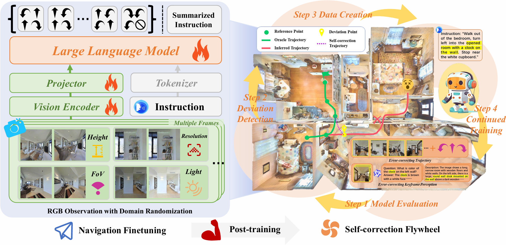

<div align="center">

# AAAI 2025 - CorrectNav 🧭

**Self-Correction Flywheel Empowers Vision-Language-Action Navigation Model**



<h3>Real-Robot Demonstrations</h3>

<table>
  <tr>
    <td><video src="site_assets/18.mp4" width="240" muted loop controls playsinline></video></td>
    <td><video src="site_assets/19.mp4" width="240" muted loop controls playsinline></video></td>
    <td><video src="site_assets/20.mp4" width="240" muted loop controls playsinline></video></td>
  </tr>
  <tr>
    <td><video src="site_assets/1.mp4" width="240" muted loop controls playsinline></video></td>
    <td><video src="site_assets/2.mp4" width="240" muted loop controls playsinline></video></td>
    <td><video src="site_assets/3.mp4" width="240" muted loop controls playsinline></video></td>
  </tr>
  <tr>
    <td><video src="site_assets/4.mp4" width="240" muted loop controls playsinline></video></td>
    <td><video src="site_assets/5.mp4" width="240" muted loop controls playsinline></video></td>
    <td><video src="site_assets/6.mp4" width="240" muted loop controls playsinline></video></td>
  </tr>
</table>

</div>

Existing vision-and-language navigation models often deviate from the correct trajectory when executing instructions. However, these models lack effective error correction capability, hindering their recovery from errors.

To address this challenge, we propose the **Self-correction Flywheel**, a novel post-training paradigm. Instead of considering the model’s error trajectories on the training set as a drawback, our paradigm emphasizes their significance as a valuable data source. We have developed a method to identify deviations in these error trajectories and devised innovative techniques to automatically generate self-correction data for perception and action. These self-correction data serve as fuel to power the model’s continued training.

The brilliance of our paradigm is revealed when we re-evaluate the model on the training set, uncovering new error trajectories. At this time, the self-correction flywheel begins to spin. Through multiple flywheel iterations, we progressively enhance our monocular RGB-based VLA navigation model, **CorrectNav**.

## 🚀 Release Status

* [x] Release CorrectNav model weights.
* [x] Release evaluation scripts for the R2R-CE benchmark.
* [ ] Release real-world fine-tuning code (Coming Soon!).

---

## 🛠️ 1. Installation

We recommend setting up the environment on an RTX 3090 workstation with Ubuntu 22.04 and CUDA 12.1.

### 1.1 Create a Conda Environment

```bash
conda create -n CorrectNav python=3.10 cmake=3.14.0 -y
conda activate CorrectNav

```

### 1.2 Install Habitat Simulator

You will need to install specific versions of Habitat:

1. **[habitat-lab 0.3.1](https://github.com/facebookresearch/habitat-lab)**
```bash
git clone --branch stable https://github.com/facebookresearch/habitat-lab.git
cd habitat-lab
pip install -e habitat-lab  # install habitat_lab

```


2. **[habitat-sim 0.3.3](https://github.com/facebookresearch/habitat-sim/blob/main/BUILD_FROM_SOURCE.md)**
Please follow the official **Build from Source** instructions to build habitat-sim in headless mode with CUDA support.

### 1.3 Install CorrectNav Dependencies

From the root directory of this repository, run:

```bash
pip install --upgrade pip
pip install -e ".[train]"
pip install flash-attn --no-build-isolation

```

> **Note:** If you only need inference/serving, you can use `pip install -e ".[standalone]"` instead, and install extra runtime dependencies as needed.

### 1.4 Prepare the VLN-CE Dataset

Prepare the VLN datasets (R2R / RxR) by following the instructions in the [VLN-CE Data Section](https://github.com/jacobkrantz/VLN-CE?tab=readme-ov-file#data) to set up the MP3D scene dataset and VLN-CE episodes dataset.

Create a new directory named `habitat-data-0.2.5` and organize your downloaded datasets exactly as shown below:

```text
habitat-data-0.2.5/
├── datasets/
│   └── vlnnav/
│       ├── r2r/
│       │   ├── test/
│       │   ├── train/
│       │   │   ├── decompose.py
│       │   │   ├── filter.json
│       │   │   └── ...
│       │   ├── val_seen/
│       │   └── val_unseen/
│       └── rxr/
│           ├── test_challenge/
│           ├── train/
│           ├── val_seen/
│           └── val_unseen/
└── scenes/
    └── mp3d/
        ├── 17DRP5sb8fy/
        │   ├── 17DRP5sb8fy.glb
        │   ├── 17DRP5sb8fy.house
        │   ├── 17DRP5sb8fy.navmesh
        │   └── ...
        ├── 1LXtFkjw3qL/
        ├── 1pXnuDYAj8r/
        └── ...

```

---

## 🧩 2. Navigation Base Training Data Construction

### 2.1 VLN-CE Dataset Split

Before launching parallel data collection, split the training JSON.GZ file into part files used by `--part_idx`.

```bash
python data/split_vlnce_dataset.py \
  --input_json_gz /habitat-data-0.2.5/datasets/vlnnav/r2r/train/train.json.gz \
  --output_dir /habitat-data-0.2.5/datasets/vlnnav/r2r/train \
  --split train \
  --n_part 16

python data/split_vlnce_dataset.py \
  --input_json_gz /habitat-data-0.2.5/datasets/vlnnav/rxr/train/train.json.gz \
  --output_dir /habitat-data-0.2.5/datasets/vlnnav/rxr/train \
  --split train \
  --n_part 20

```

### 2.2 VLN-CE Data Collection

Use `scripts/collect_training_data.sh` to launch multiple `data/collect_training_data.py` processes.

```bash
bash scripts/collect_training_data.sh \
  r2r \
  /path/to/vlnce_r2r_data \
  16

bash scripts/collect_training_data.sh \
  rxr \
  /path/to/vlnce_rxr_data \
  20

```

### 2.3 VLN-CE Image Data to Video

Use `scripts/vlnce_rgbs2video.sh` to convert collected VLN-CE RGB frames into per-step video files.

```bash
bash scripts/vlnce_rgbs2video.sh \
  /path/to/vlnce_r2r_data \
  /path/to/vlnce_r2r_video \
  32

bash scripts/vlnce_rgbs2video.sh \
  /path/to/vlnce_rxr_data \
  /path/to/vlnce_rxr_video \
  32

```

### 2.4 Trajectory-to-Instruction JSON Generation

Use `data/traj2instruct.py` to generate trajectory-to-instruction training JSON after VLN-CE trajectory collection.

```bash
python data/traj2instruct.py \
  --raw_training_data_path /path/to/vlnce_r2r_data \
  --video_root_path /path/to/vlnce_r2r_video \
  --output_json_path /path/to/vlnce_r2r_t2i.json \
  --data_source vlnce_r2r_t2i

python data/traj2instruct.py \
  --raw_training_data_path /path/to/vlnce_rxr_data \
  --video_root_path /path/to/vlnce_rxr_video \
  --output_json_path /path/to/vlnce_rxr_t2i.json \
  --data_source vlnce_rxr_t2i

```

### 2.5 General Visual Understanding Data Preparation

Download the [LLaVA-Video-178K](https://huggingface.co/datasets/lmms-lab/LLaVA-Video-178K) dataset and use the following subsets together with the GT VLN-CE data for navigation model training.

```text
0_30_s_academic_v0_1
0_30_s_activitynetqa
0_30_s_nextqa
0_30_s_perceptiontest

```

Write the annotation JSON or JSONL paths from these subsets into `scripts/train_mixed.yaml` together with the GT VLN-CE JSON files generated in Section 2.4.

---

## 🏋️ 3. Flywheel Data Collection and Continued Training

### 3.1 Correction Data Collection

Use `scripts/eval_train_fly.sh` to launch multiple `data/eval_train_fly.py` processes.

```bash
bash scripts/eval_train_fly.sh \
  r2r \
  /path/to/model_checkpoint \
  /path/to/fly_r2r_data \
  /path/to/logs \
  8

bash scripts/eval_train_fly.sh \
  rxr \
  /path/to/model_checkpoint \
  /path/to/fly_rxr_data \
  /path/to/logs \
  8

```

### 3.2 Correction Image Data to Video

Use `scripts/fly_rgbs2video.sh` to convert saved correction RGB frames into per-step video files.

```bash
bash scripts/fly_rgbs2video.sh \
  /path/to/fly_r2r_data \
  /path/to/r2r_video_fly \
  32

bash scripts/fly_rgbs2video.sh \
  /path/to/fly_rxr_data \
  /path/to/rxr_video_fly \
  32

```

### 3.3 Training JSON Generation

Use `data/train_json.py` to generate the training JSON consumed by the post-training stage.

```bash
python data/train_json.py \
  --raw_training_data_path /path/to/fly_r2r_data \
  --video_root_path /path/to/r2r_video_fly \
  --output_json_path /path/to/vlnce_r2r_video_fly.json \
  --data_source vlnce_r2r \
  --gt_step 6

python data/train_json.py \
  --raw_training_data_path /path/to/fly_rxr_data \
  --video_root_path /path/to/rxr_video_fly \
  --output_json_path /path/to/vlnce_rxr_video_fly.json \
  --data_source vlnce_rxr \
  --gt_step 6

```

### 3.4 Mixed Dataset YAML

Write the generated training JSON files into `scripts/train_mixed.yaml` before starting training.

```yaml
datasets:
  - json_path: /path/to/dataset1.json
    sampling_strategy: all

  - json_path: /path/to/dataset2.json
    sampling_strategy: random:50%

  - json_path: /path/to/dataset3.json
    sampling_strategy: first:10000

  - json_path: /path/to/dataset4.json
    sampling_strategy: end:3000
  …………
```

`json_path` is the full path to each training JSON or JSONL. The trajectory-to-instruction JSON files are generated by `data/traj2instruct.py`, the general visual understanding data comes from the selected LLaVA-Video-178K subsets, and the correction JSON files are generated by `data/train_json.py`. `sampling_strategy` controls how many samples are loaded from each file and supports `all`, `first:N`, `end:N`, `random:N`, `first:N%`, `end:N%`, and `random:N%`.

### 3.5 Training Script Configuration

Set the manual fields at the beginning of `scripts/train_mixed.sh`.

```bash
DATA_YAML="scripts/train_mixed.yaml"
MID_RUN_NAME="correctnav_mixed"
IMAGE_FOLDER="/"
VIDEO_FOLDER="/"
PREV_STAGE_CHECKPOINT="/path/to/model_checkpoint"
VISION_MODEL_VERSION="google/siglip-so400m-patch14-384"
PROMPT_VERSION="qwen_1_5"
GPU_NUM=8
PER_DEVICE_TRAIN_BATCH_SIZE=1
PER_DEVICE_EVAL_BATCH_SIZE=4
GRADIENT_ACCUMULATION_STEPS=2
DEEPSPEED_CONFIG="scripts/zero3.json"
MASTER_PORT=30000

```

`DATA_YAML` points to the YAML file containing the mixed JSON list. `MID_RUN_NAME` names the training run and the output directory under `work_dirs`. `IMAGE_FOLDER` is the root directory prepended to image fields in JSON; for video-only VLN data, `/` is sufficient. `VIDEO_FOLDER` is the root directory prepended to video fields in JSON; use `/` when the generated JSON stores absolute video filenames, or use the shared video directory when it stores relative filenames. `PREV_STAGE_CHECKPOINT` points to the model checkpoint used as the training starting point.

`VISION_MODEL_VERSION` is the visual encoder used by the model. `PROMPT_VERSION` selects the conversation template used during supervised fine-tuning. `GPU_NUM` is the number of GPUs passed to DeepSpeed. `PER_DEVICE_TRAIN_BATCH_SIZE` is the batch size on each GPU. `GRADIENT_ACCUMULATION_STEPS` is the number of forward and backward passes accumulated before one optimizer update. The effective training batch size is `GPU_NUM * PER_DEVICE_TRAIN_BATCH_SIZE * GRADIENT_ACCUMULATION_STEPS`. `PER_DEVICE_EVAL_BATCH_SIZE` is kept for trainer argument completeness. `DEEPSPEED_CONFIG` points to the DeepSpeed configuration file, and `MASTER_PORT` is the distributed training communication port.

### 3.6 Mixed Dataset Training

Use `scripts/train_mixed.sh` to start mixed dataset supervised fine-tuning after editing the fields above.

```bash
bash scripts/train_mixed.sh

```

---

## 📊 4. Evaluation on R2R-CE Benchmark

We provide comprehensive scripts to evaluate CorrectNav:

* **Runner:** `eval_vln_r2r_6.py`
* **Launcher:** `eval.sh`

### 4.1 Download Model Weights

📥 **[Download CorrectNav Model Weights Here](https://disk.pku.edu.cn/link/AAFD453AC93DEE4A5F8C84C14CC73D0AC1)**

### 4.2 Configuration

Before starting the evaluation, please update the evaluation scripts with your local paths and settings:

* `pretrained = "YOUR_MODEL_PATH"`
* `ckpt_chosen = ...` *(Used for naming logs and JSON outputs)*
* `CUDA_VISIBLE_DEVICES = "0..7"` *(Adjust based on your GPU availability)*

### 4.3 Run Evaluation

Start the evaluation by executing the launcher script:

```bash
bash scripts/eval.sh

```

---

## 📝 Citation

If you find our work, code, or model weights helpful in your research, please consider citing our paper:

```bibtex
@misc{correctnav,
      title={CorrectNav: Self-Correction Flywheel Empowers Vision-Language-Action Navigation Model}, 
      author={Zhuoyuan Yu and Yuxing Long and Zihan Yang and Chengyan Zeng and Hongwei Fan and Jiyao Zhang and Hao Dong},
      year={2025},
      eprint={2508.10416},
      archivePrefix={arXiv},
      primaryClass={cs.RO},
      url={https://arxiv.org/abs/2508.10416}, 
}

```
